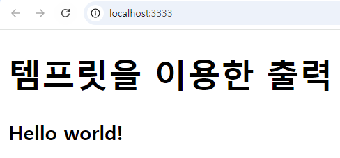

# Node.js express 뷰엔진

# HTTP  모듈을 이용한 서버 구현

- 브라우저 화면 출력 내용을 서버에서 직접 출력.
- response.end() 또는  response.write()에 html 문자열을 입력한다.
- 새 프로젝트 생성 > app.js에 서버 구현
- npm -g list 글로벌 환경에 설치된 모듈 확인
    
    ```bash
    rkspace-nodejs\proj02express> npm list -g
    C:\Users\WD\AppData\Roaming\npm
    ├── firebase-tools@13.18.0
    ├── nodemon@3.1.4
    ├── npx@10.2.2
    ├── ts-node@10.9.2
    └── typescript@5.6.2
    ```
    

## 프로젝트 생성 및 설정

- 새 프로젝트 생성
    
    ```bash
    npm init -y
    ```
    
- 기본적으로 사용하는 의존성 모듈 설치
    
    ```bash
    npm i -D nodemon
    ```
    
- 개발 환경에서 필요한 의존성 모듈 설치
    
    ```bash
    npm i -S expresscors
    ```
    
- package.json 에  nodemon과 실행 관련 스크립트 추가
- 실행: npm run start
- 노드몬 실행: npm run dev
    
    ```jsx
    {
      "name": "proj02express",
      "version": "1.0.0",
      "main": "index.js",
      "scripts": {
        **"start": "node app.js",
        "dev": "nodemon app.js",**
        "test": "echo \"Error: no test specified\" && exit 1"
      },
      "keywords": [],
      "author": "",
      "license": "ISC",
      "description": "",
      "dependencies": {
        "cors": "^2.8.5",
        "express": "^4.21.0"
      },
      "devDependencies": {
        "nodemon": "^3.1.7"
      }
    }
    
    ```
    

## 가장 기본 적인 구조

- app.js 1단계
    
    ```jsx
    const http = require("http");
    
    const PORT = 3333;
    
    const server = http.createServer((request, response)=>{
        response.end("Hello world");
    })
    server.listen(PORT, ()=>{
        console.log(`서버 실행 중 >>> http://localhost:${PORT}`);
    });
    ```
    
- app.js 설정 2단계 : document.write()를 이용해서  HTML 출력.
    
    ```jsx
    const http = require("http");
    
    const PORT = 3333;
    
    const server = http.createServer((request, response)=>{
        response.writeHead(200, {"Content-Type":"text/html; charset=UTF-8"});
        response.write("<!DOCTYPE html>");
        response.write("<html>");
        response.write("<head><title>첫번째 nodejs 서버</title></head>");
        response.write("<body>");
        response.write("<h1>Hello nodejs world</h1>");
        response.write("<h3>여러분 안녕하세요</h3>");
        response.write("</body>");
        response.write("</html>");
        response.end();
    });
    
    server.listen(PORT, ()=>{
        console.log(`서버 실행 중 >>> http://localhost:${PORT}`);
    });
    ```
    
- 기본 설정 3단계 app.js
    - 템플릿 문자열을 이용해서 웹 페이지 구성
    
    ```jsx
    const http = require("http");
    
    const PORT = 3333;
    
    const title = "템프릿을 이용한 출력";
    const html = `
    <!DOCTYPE html>
    <html lang="en">
    <head>
        <meta charset="UTF-8">
        <meta name="viewport" content="width=device-width, initial-scale=1.0">
        <title>${title}</title>
    </head>
    <body>
        <h1>${title}</h1>
        <h3>Hello world!</h3>
    </body>
    </html>
    `;
    
    const server = http.createServer((request, response)=>{
        response.writeHead(200, {"Content-Type":"text/html; charset=UTF-8"});
        response.end(html);
    });
    
    server.listen(PORT, ()=>{
        console.log(`서버 실행 중 >>> http://localhost:${PORT}`);
    });
    ```
    
- 실행 결과



# express 프레임워크 static 설정

- express.static 미들웨어 설정
    
    ```jsx
    // static 폴더 설정
    app.use(express.static('public'));
    ```
    
- 먼저 프로젝트에 public 폴더 생성


- public 폴더에  index.html 페이지 생성.
    
    ```jsx
    <!DOCTYPE html>
    <html lang="en">
    <head>
        <meta charset="UTF-8">
        <meta name="viewport" content="width=device-width, initial-scale=1.0">
        <title>Document</title>
    </head>
    <body>
        <h1>Nodejs 학습</h1>
        <h3>Hello world!</h3>
        <p></p>
    </body>
    </html>
    ```
    

# express프레임워크의 template engin을 이용

- 정적페이지는  public에서 서비스 : static페이지, html, 이미지, 사운드 등.
- 동적페이지는 views에서 서비스 : 템플릿 엔진을 이용해서 동적 페이지 구현.
- ejs 또는 pug를 많이 사용한다.
- ejs  모듈 설치
    
    ```bash
    # 전체 형식
    npm install --save ejs
    # 축약 형식
    npm i -S ejs
    ```
    
- package.json에 추가 됨.
    
    ```json
    "dependencies": {
      "cors": "^2.8.5",
      **"ejs": "^3.1.10",**
      "express": "^4.21.0"
    },
    "devDependencies": {
      "nodemon": "^3.1.7"
    }
    ```
    

## ejs 공식 사이트

- 공식 사이트의 문서와  get start 메뉴를 확인
- [https://ejs.co/](https://ejs.co/)

## ejs 기본 문법

- <%와 %> 사이에 자바스크립트 문법 사용
    
    ```jsx
    <% // 자바스크립트 코드 %>
    <!-- HTML 코드 -->
    ```
    
- 예시
    
    ```jsx
    <%= 출력 데이터 %>
    <%- 출력 데이터 %>
    <%- include('경로', 파라미터) %>
    ```
    

## ejs 동적 디렉토리 설정

- 뷰엔진 설정
    
    ```jsx
    // 뷰엔진 설정
    app.set('view engine', 'ejs');
    app.set('views', path.join(__dirname, 'views'));
    ```
    
- 뷰페이지 렌더링
    
    ```jsx
    app.get('/car/list', (req, res)=>{
        // nodejs 콜백함수의 첫번째 인자는 error 객체
        req.app.render('car/list', {}, (err, html)=>{
    		    if(err) throw err;
            res.end(html);
        });
    })
    ```
    
- views/car/list.ejs
    - 파라미터로 전달 받은 carList를 목록으로 출력
    
    ```html
    <!DOCTYPE html>
    <html lang="en">
    <head>
        <meta charset="UTF-8">
        <meta name="viewport" content="width=device-width, initial-scale=1.0">
        <title>Document</title>
    </head>
    <body>
    
        <h1>중고차 목록</h1>
        <table border="1">
            <thead>
                <tr>
                    <th>ID</th>
                    <th>NAME</th>
                    <th>PRICE</th>
                    <th>COMPANY</th>
                    <th>YEAR</th>
                </tr>
            </thead>
            <tbody>
            <% carList.forEach((car, index)=>{ %>
                <tr>
                    <td><%= index %></td>
                    <td><%= car.name %></td>
                    <td><%= car.price %></td>
                    <td><%= car.company %></td>
                    <td><%= car.year %></td>
                </tr>
            <% })  %>
            </tbody>
        </table>
    </body>
    </html>
    ```
    
- app.js 전체 내용

```jsx
const http = require("http");
const express = require("express");
const app = express();
const path = require("path");

const title = "자동차 목록";

// port 환경 변수 등록
app.set('port', 3333);
// 뷰엔진 설정
app.set('view engine', 'ejs');
app.set('views', path.join(__dirname, 'views'));

// static 폴더 설정
app.use(express.static( path.join(__dirname, 'public')));

// 데이터 베이스에서 가져온 데이터로 대체될 임시 목록
const carList = [
    {_id:1001, name:"GRANDEUR", price:3500, company:"HYUNDAI", year:2019},
    {_id:1002, name:"SONATA2", price:2500, company:"HYUNDAI", year:2022},
    {_id:1003, name:"BMW", price:5500, company:"BMW", year:2018},
    {_id:1004, name:"S80", price:4500, company:"VOLVO", year:2023}
];

app.get('/car/list', (req, res)=>{
    // nodejs 콜백함수의 첫번째 인자는 error 객체
    req.app.render('car/list', {carList}, (err, html)=>{
        if(err) throw err;
        res.end(html);
    });
})

const server = http.createServer(app);
server.listen(app.get('port'), ()=>{
    console.log(`서버 실행 중 >>> http://localhost:${app.get('port')}`);
});
```

- 실행 결과

